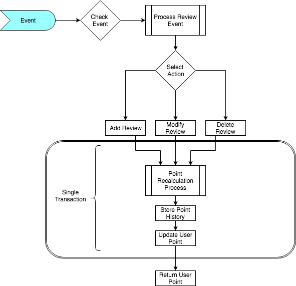

# Getting Started

### Important Points

- add, modify and delete operations for /event controller are performed with same parameter.
- in case modify command caller must send filled parameters. (Ex, if photos parameter has no photoIds then it will be considered as a removal of photos)

### Operations

In total three operations are allowed: add, modify and delete. These operation commands can be called in a two way:
- All commands goes through POST command. Then ActionType field must be checked by the sender side
- Commands are following the RESTful VERBS: PUT, DELETE. if the PUT is used then ActionType is changed to MOD type which means modification.
Controller with DELETE verb would change ActionType to DELETE.

##### Detail Commands


- add

```
{
 "type": "REVIEW",
 "action": "ADD", 
 "reviewId": "240a0658-dc5f-487-9381-ebb7b6677",
 "content": "",
 "attachedPhotoIds": ["aaaa", "bbb", "cccc", "dddd"],
 "userId": "3ede0ef2-92b7-4817-a5f3-0c575361f745",
 "placeId": "2e4baf1c-5acb-4efb-a1af-eddada31b"
}
```

In response we have two points: 1pt for being a first reviewer on given place, 1pt for adding photo. 
But we couldn't earn additional 1pt, because we didn't upload content

```
{
 "type": "REVIEW",
 "action": "MOD", 
 "reviewId": "240a0658-dc5f-487-9381-ebb7b6677",
 "content": "Text for review content",
 "attachedPhotoIds": [],
 "userId": "3ede0ef2-92b7-4817-a5f3-0c575361f745",
 "placeId": "2e4baf1c-5acb-4efb-a1af-eddada31b"
}
```

Now we get our 1pt for adding a content to our given review. 
It must be noticed that attachedPhotoIds must be empty if we would like to add content only. 
If attachedPhotoIds contain any photoId then it will be added to our photo list.

- delete:

```
{
 "type": "REVIEW",
 "action": "DELETE", 
 "reviewId": "240a0658-dc5f-487-9381-ebb7b6677",
 "content": "",
 "attachedPhotoIds": ["aaaa", "bbb", "cccc", "dddd"],
 "userId": "3ede0ef2-92b7-4817-a5f3-0c575361f745",
 "placeId": "2e4baf1c-5acb-4efb-a1af-eddada31b"
}
```

Now we are deleting content and all attached photos by giving their ID list.
PhotoIds list defines which photos must be deleted from the list. 
Empty content field shows our intention for deleting content.


### Architecture

